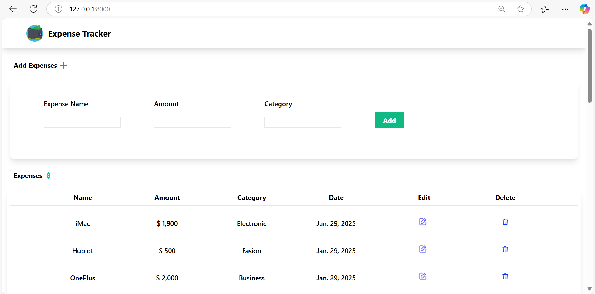
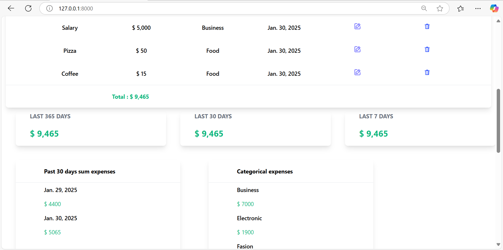
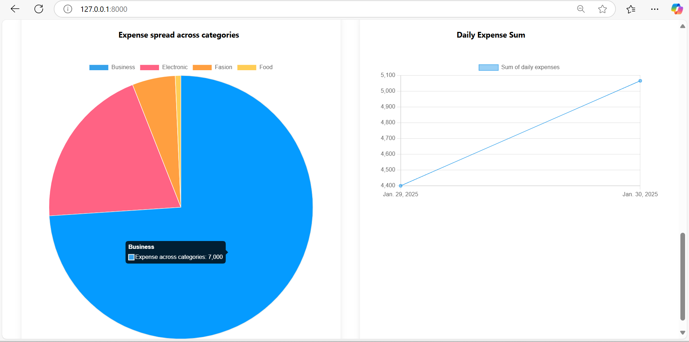
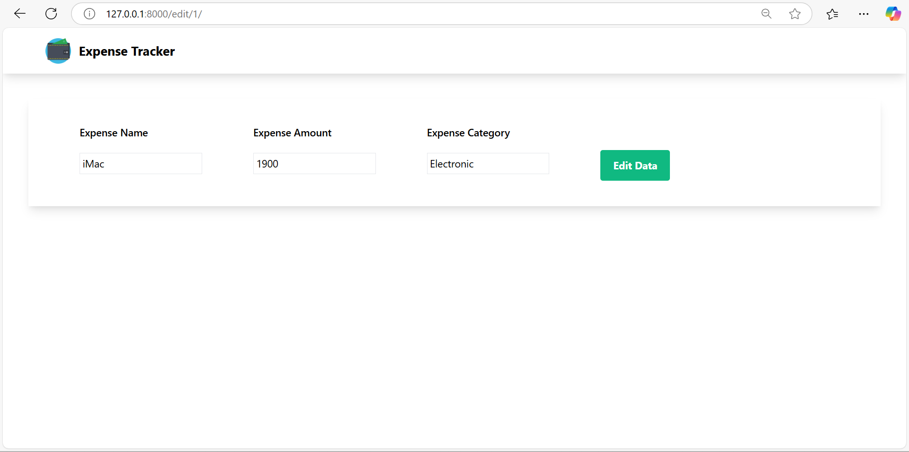
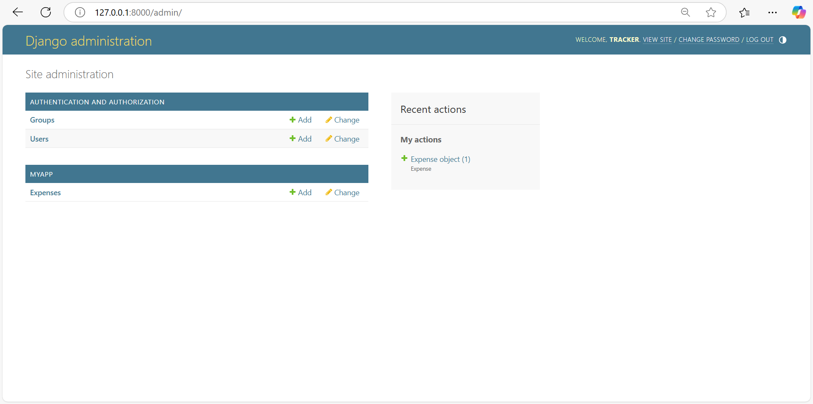

# Expense Tracker Web Application

## Project Overview
The Expense Tracker Web Application is a simple and efficient tool designed to help users manage their expenses. Built with Python and Django, the application allows users to add, edit, and delete expenses while providing insightful analytics through visual charts and expense summaries.

## Features
- **Add Expenses:** Easily log expense details, including name, amount, and category.
- **Expense Management:** Edit or delete existing expense entries.
- **Expense Overview:** View a categorized list of expenses along with their respective dates.
- **Total Expense Calculation:** Automatic computation of total expenses.
- **Expense Analytics:**
  - Pie chart visualization of expenses across categories.
  - Line graph showing daily expense trends.
  - Summary cards for expenses over the last 365, 30, and 7 days.

## Technologies Used
- **Frontend:** HTML, CSS, JavaScript
- **Backend:** Django (Python)
- **Database:** SQLite
- **Charting Library:** Chart.js

## Installation Instructions

### Prerequisites
Ensure you have the following installed on your system:
- Python 3.x
- pip install django
- Virtual environment (env)

### Steps to Set Up the Project
1. Clone the repository:
   ```bash
   git clone https://github.com/CoderMahruf/Expense-tracker.git
   cd mysite/
   ```
2. Create and activate a virtual environment:
   ```bash
   python -m venv env
   env\Scripts\activate   
   ```
3. Install the required dependencies:
   ```bash
   pip install -r requirements.txt
   ```
4. Apply database migrations:
   ```bash
   python manage.py migrate
   ```
5. Start the development server:
   ```bash
   python manage.py runserver
   ```
6. Open your browser and navigate to `http://127.0.0.1:8000/` to access the application.

## Usage Instructions
1. Navigate to the "Add Expenses" section to log new expenses by providing the name, amount, and category.
2. Review your expenses in the "Expenses" table.
3. Use the edit and delete icons to manage your existing expenses.
4. Analyze your spending habits using the expense charts and summary statistics.

## Folder Structure
```
expense-tracker/
├── manage.py
├── expense_tracker/  # Main application folder
├── templates/        # HTML templates
├── static/           # Static files (CSS, JS, images)
└── requirements.txt  # Dependencies
```

## Screenshots
### Dashboard and Expense Entry

### Expense Analytics

### Expense Analytics

### Expense Analytics

### Admin Panel


## Future Enhancements
- Add user authentication for personalized expense tracking.
- Integrate filtering and search functionality for better navigation.
- Provide export options for downloading expense reports.
- Include multi-currency support.

## Contributing
Contributions are welcome! Please fork the repository and submit a pull request with your improvements.

## License
This project is licensed under the MIT License.

## Contact
If you have any questions or suggestions, feel free to reach out to the project owner at [mahruf9060@gmail.com].

